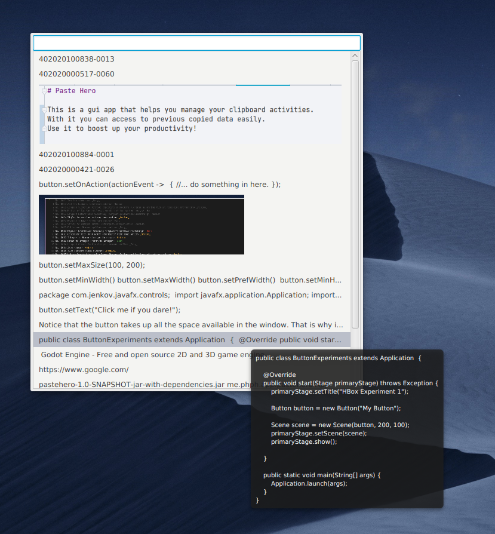

# Paste Hero

This is a gui app that helps you manage your clipboard activities.    
With it, you can access to previous copied data easily.    
Use it to boost up your productivity!



#### Requirements

Now the app only runs on linux platform (Dbus is enabled). (Support for Windows is coming)

Maven
Java 1.8+

#### Restrictions

Only support linux with dbus enabled.
Only tested in Manjaro KDE.

#### Usage

Create a shortcut to trigger a dbus call system-wide. For example Ctrl+Shift+V

me.phph.app.pastehero /pastehero show

Once the shortcut is triggered, the clipboard selection will popup, and you can make your selection easily.

The entry you selected will be copied to clipboard and for now you are good to go.

The entries honor an LRU cache strategy, that means the most recently copied entry will be displayed at topmost position.

The cache will hold 100 entries by default.

If you want to add some default entries, just edit the following file:

```
~/.pastehero/defaut_entries
```

#### Shortcuts

The first 10 entries are mapped with Alt+N shortcuts for you to make quick selection.

**Main window shortcuts:**

Ctrl + E        Shows a window where you can edit the item

Ctrl + X        Delete the focused item

Ctrl + R        Rearrange the displayed items, remap the number if necessary

Ctrl + Q        Focus on the search bar and type to search

Esc             Hide main window

**Edit window shortcuts:**

Ctrl + S        Save and hide edit window

Esc             Hide edit window and leave the item untouched


#### Packaging

```
mvn package
```

#### Run

```
nohup java -Xms128m -Xmx256m -XX:+UseG1GC \
    -Djdk.gtk.version=3 \ 
    -jar pastehero-0.0.1-jar-with-dependencies.jar > .pastehero.log 2>&1 &
```


